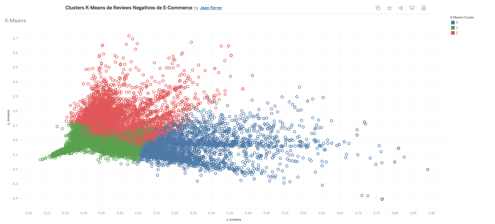
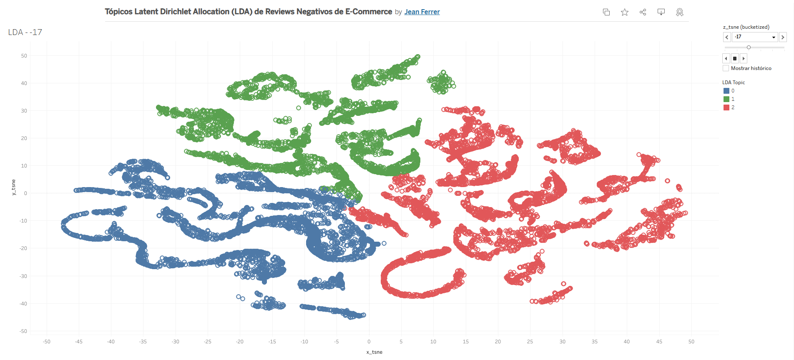
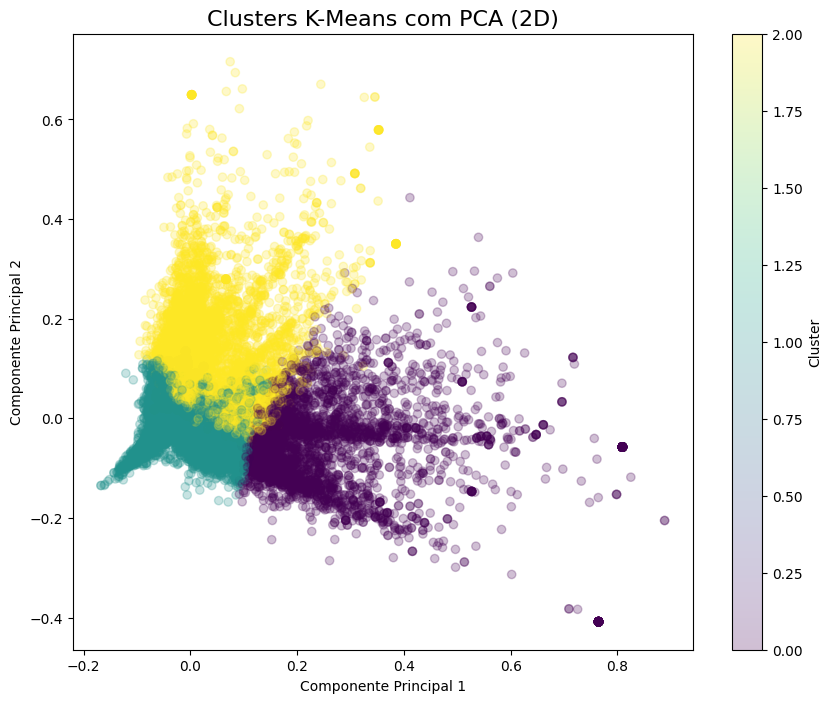
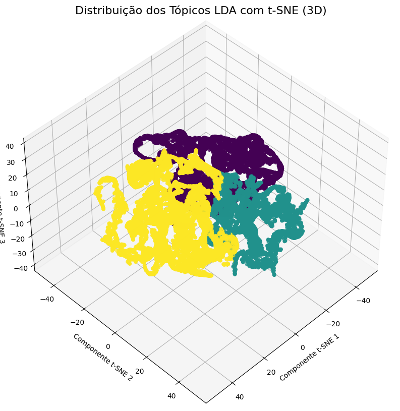

# Natural Language Processing (NLP) e Unsupervised Machine Learning em E-Commerce

Este projeto aplica técnicas de Natural Language Processing (Processamento de Linguagem Natural) e Unsupervised Machine Learning (Aprendizado de Máquina Não Supervisionado) para identificar padrões em comentários negativos de plataformas de vendas brasileiras, agrupando textos semelhantes e extraindo tópicos relevantes.

### Visualizações Interativas

*Clusters K-Means de Reviews Negativos de E-Commerce*  
https://public.tableau.com/app/profile/jeanferrer/viz/ClustersK-MeansdeReviewsNegativosdeE-Commerce/K-Means

*Tópicos Latent Dirichlet Allocation (LDA) de Reviews Negativos de E-Commerce*  
https://public.tableau.com/app/profile/jeanferrer/viz/TpicosLatentDirichletAllocationLDAdeReviewsNegativosdeE-Commerce/LDA

### Como Utilizar

- Clone este repositório.
- Baixe o data set `bw2.csv` do Kaggle: https://www.kaggle.com/code/abnerfreitas/nlp-buscape-data-ptbr-sentiment-analysis/input
- Crie e ative um ambiente virtual.
- Instale as dependências: `pip install -r requirements.txt`.

O projeto foi desenvolvido com `Python 3.12.4`.

## Extração e Representação do Corpus

Nesta etapa, o corpus de comentários negativos é coletado, processado e transformado em uma representação numérica para aplicação de algoritmos de aprendizado de máquina.

### Criação do DataFrame, Separação e Pré-Processamento do Corpus

- O dataset é carregado a partir de um arquivo CSV e filtrado para manter apenas os comentários classificados como negativos.
- O texto passa por um processo de limpeza e normalização utilizando o modelo de língua portuguesa `pt_core_news_lg` do spaCy.
- Stop-words comuns e termos irrelevantes (ex.: nomes de lojas, verbos genéricos) são removidos.
- O corpus é lematizado para reduzir palavras à sua forma base.

### Representação Numérica do Texto

- **Term Frequency-Inverse Document Frequency (TF-IDF):** Utilizado para atribuir pesos às palavras de acordo com sua relevância – dentro de cada documento e em relação ao corpus inteiro.
- **Bag-of-Words (BoW):** Utilizado para contar a ocorrência de palavras no corpus.
- As palavras mais frequentes são extraídas e analisadas para melhor compreensão da distribuição dos termos (e possível inserção na etapa anterior de remoção de stop-words).

## Unsupervised Machine Learning

Nesta etapa, são aplicadas técnicas de aprendizado de máquina não supervisionado para identificar padrões e agrupar comentários semelhantes.

### Clusterização com K-Means

- O algoritmo **K-Means** é treinado sobre a matriz TF-IDF para agrupar comentários em 3 clusters distintos.
- Um novo comentário pode ser classificado dentro de um desses clusters após passar pelo mesmo processo de vetorização.
- A visualização dos clusters é feita através de **redução de dimensionalidade com Principal Component Analysis (PCA)**, para um espaço bidimensional.

### Extração de Tópicos com Latent Dirichlet Allocation (LDA)

- O algoritmo **Latent Dirichlet Allocation (LDA)** é treinado sobre a representação Bag-of-Words (BoW) para definir distribuições de palavras associadas a diferentes tópicos.
- Cada comentário recebe uma distribuição de probabilidade sobre os tópicos extraídos.
- A visualização dos clusters é feita através de **redução de dimensionalidade com t-Distributed Stochastic Neighbor embedding (t-SNE)**, para um espaço tridimensional.

## Visualização dos Resultados no Tableau

Os resultados das análises foram exportados para um arquivo CSV contendo:

- **corpus_preprocessed:** Textos pré-processados;
- **cluster_kmeans:** Número do cluster K-Means para cada texto;
- **x_kmeans:** Primeira componente principal PCA, ou eixo x do K-Means;
- **y_kmeans:** Segunda componente principal PCA, ou eixo y do K-Means;
- **topic_lda:** Número do tópico Latent Dirichlet Allocation (LDA) para cada texto;
- **x_tsne:** Primeira componente t-SNE, ou eixo x do LDA;
- **y_tsne:** Segunda componente t-SNE, ou eixo y do LDA;
- **z_tsne:** Terceira componente t-SNE, ou eixo z do LDA;

A visualização foi realizada no **Tableau**:

- **K-Means:** Gráfico 2D para representar os clusters.
- **LDA:** Gráfico 2D com profundidade, no qual a coordenada `z` foi convertida em categorias (bucketizing) para melhor interpretação dos tópicos.

Essa abordagem permite uma análise interativa dos clusters e tópicos, facilitando a extração de insights sobre os principais problemas relatados pelos consumidores.
